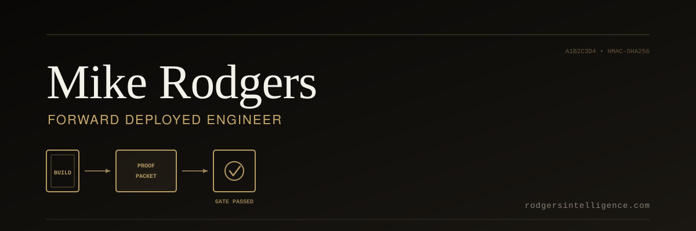
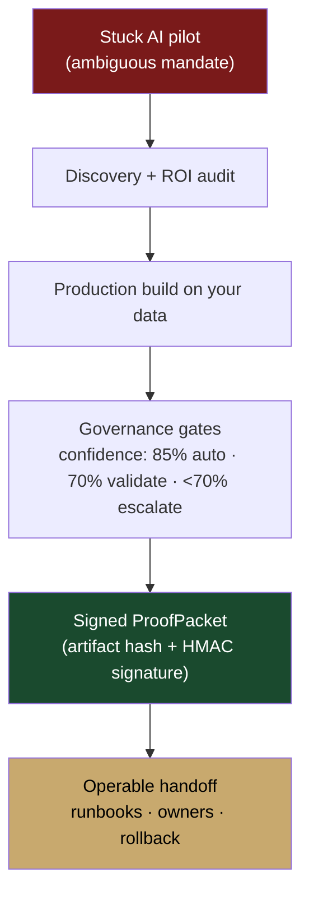

<p align="center">
  
</p>

# Mike Rodgers

> **I turn AI pilots into production systems you can defend in a board meeting.**

**Forward Deployed Engineer · Fractional Chief AI Officer** — Denver, CO
*One operator. One machine. Every receipt public.*

[rodgersintelligence.com](https://rodgersintelligence.com/) · [LinkedIn](https://www.linkedin.com/in/mike-rodgers-14416414/) · [Resume PDF](https://github.com/mrodgersjs-web/resume/blob/main/Mike-Rodgers-Forward-Deployed-Engineer.pdf) · [mrodgersjs@gmail.com](mailto:mrodgersjs@gmail.com) · 262.343.5680

---

## Install me as a teammate

```bash
npx mrodgersjs-web --ask "how do proof gates work?"
```

> [`mrodgersjs-web-teammate`](https://github.com/mrodgersjs-web/mrodgersjs-web-teammate) — a pure-stdlib Node CLI that installs my FDE knowledge base locally. `--ask`, `--audit`, `--deploy`. Zero dependencies.

---

## The flagship

### [`proof-studio`](https://github.com/mrodgersjs-web/proof-studio) — catch AI agents when they lie about "done"

```bash
git clone https://github.com/mrodgersjs-web/proof-studio.git
cd proof-studio/packages/rigforge && pip install -e . && rigforge demo
```

> A forged `BUILD COMPLETE` fails the HMAC signature check. **If a gate cannot fail, it is theater.**

Now also available as a **GitHub Action**: [`proof-gate-action`](https://github.com/mrodgersjs-web/proof-gate-action) — add proof verification to any CI pipeline.

```yaml
- uses: mrodgersjs-web/proof-gate-action@v1
  with:
    proofpacket-path: proofpacket.json
    secret-key: ${{ secrets.PROOF_KEY }}
```

---

## Track record (numbers, not narratives)

| Outcome | Evidence |
| --- | --- |
| **$6B → $32B** merger (Advocate Health + Atrium) | [Public record](https://en.wikipedia.org/wiki/Advocate_Health) — drove the growth thesis |
| **ED wait: 3 hrs → 15 min** across 5 hospital systems | GWU Emergency Care Innovation Award · 130K+ patients |
| **130+ AI agents** in governed production | MICI OS — 5-layer governance, confidence-gated (85/70) |
| **$4B+ M&A pipeline** managed | Oracle Cerner · $150M strategic initiative · $35M opex reduction |
| **$10M Series A** raised mid-COVID | EmOpti telehealth · 35% CAGR |
| **90-day** AI operating-system deployment | Built 3x from zero (83 Tech Harbor, InvestMKE, MICI OS) |

---

## What I ship



---

## Open-source systems

| System | What it does | Verify |
| --- | --- | --- |
| [**proof-studio**](https://github.com/mrodgersjs-web/proof-studio) | Catch false "done" — signed completion detection | `rigforge demo` |
| [**proof-gate-action**](https://github.com/mrodgersjs-web/proof-gate-action) | GitHub Action: proof verification in any CI | 6/6 tests pass |
| [**rig-deviate**](https://github.com/mrodgersjs-web/rig-deviate) | 40 deviation engines × 14σ rungs — push past the LLM median | `pip install rig-deviate` |
| [**rig-ai-engineering**](https://github.com/mrodgersjs-web/rig-ai-engineering) | Prompt intelligence: 4-axis scoring, enhance, fix | `pip install rig-ai-engineering` |
| [**rig-agent-firm**](https://github.com/mrodgersjs-web/rig-agent-firm) | GitHub-native agent firm: 6 role-agents + heartbeat telemetry | fork the constitution |
| [**mrodgersjs-web-teammate**](https://github.com/mrodgersjs-web/mrodgersjs-web-teammate) | `npx mrodgersjs-web` — install me as a local CLI teammate | `npx mrodgersjs-web` |
| [**fde-portfolio**](https://github.com/mrodgersjs-web/fde-portfolio) | Discovery → eval → handoff playbooks | `bash scripts/smoke.sh` |
| [**rigforge**](https://github.com/mrodgersjs-web/rigforge) | ProofPacket platform package | `bash scripts/smoke.sh` |
| [**jake-studio**](https://github.com/mrodgersjs-web/jake-studio) | Operator OS + L10 harness (38 core tests) | `bash scripts/smoke.sh` |
| [**mesh-studio**](https://github.com/mrodgersjs-web/mesh-studio) | Fleet probe / boot / recover | `rig-mesh smoke` |

<details>
<summary><b>Full studio index</b></summary>

| Studio | Promise | Verify |
| --- | --- | --- |
| [resume](https://github.com/mrodgersjs-web/resume) | FDE resume (md · pdf · docx) | open RESUME.md |
| [app-factory-studio](https://github.com/mrodgersjs-web/app-factory-studio) | Spec → scaffold + prove | `bash scripts/smoke.sh` |
| [agency-studio](https://github.com/mrodgersjs-web/agency-studio) | Role contracts (Builder ≠ Verifier) | `bash scripts/smoke.sh` |
| [strategy-studio](https://github.com/mrodgersjs-web/strategy-studio) | Deterministic strategy routing | `bash scripts/smoke.sh` |
| [communications-studio](https://github.com/mrodgersjs-web/communications-studio) | Gated comms protocol engine | `bash scripts/smoke.sh` |
| [doctrine](https://github.com/mrodgersjs-web/doctrine) | Rules agents load before acting | `bash scripts/smoke.sh` |
| [openwork](https://github.com/mrodgersjs-web/openwork) | Operator workstation shell | `bash scripts/smoke.sh` |
| [design-studio](https://github.com/mrodgersjs-web/design-studio) | Public tokens + UI review checklists | `bash scripts/smoke.sh` |
| [patents](https://github.com/mrodgersjs-web/patents) | Patent status (titles only, no claims) | `bash scripts/smoke.sh` |
| [mike-rodgers-site](https://github.com/mrodgersjs-web/mike-rodgers-site) | Personal site → rodgersintelligence.com | open index.html |

</details>

---

## How I work

- **Outcome first.** Strategy before tech. The $32B merger wasn't a deck — it was patients getting seen faster.
- **Ground every claim.** No source → no number. No proof → no completion claim.
- **Evals before scale.** Deterministic machinery before agent autonomy.
- **Human approval on real risk.** Confidence gates: auto-execute at 85%, validate at 70%, escalate below.
- **Auditability is product quality.** Signed ProofPackets make "done" re-verifiable by anyone.
- **Smallest useful loop, then harden.** Fewer repositories, deeper modules, clearer ownership.

---

## Contact

[**rodgersintelligence.com**](https://rodgersintelligence.com/) — book a free 30-minute initial assessment.
[LinkedIn](https://www.linkedin.com/in/mike-rodgers-14416414/) · [Email](mailto:mrodgersjs@gmail.com) · 262.343.5680

---

*Forward Deployed Engineer. Documented as an operator. Verified with proof — not vibes.*
