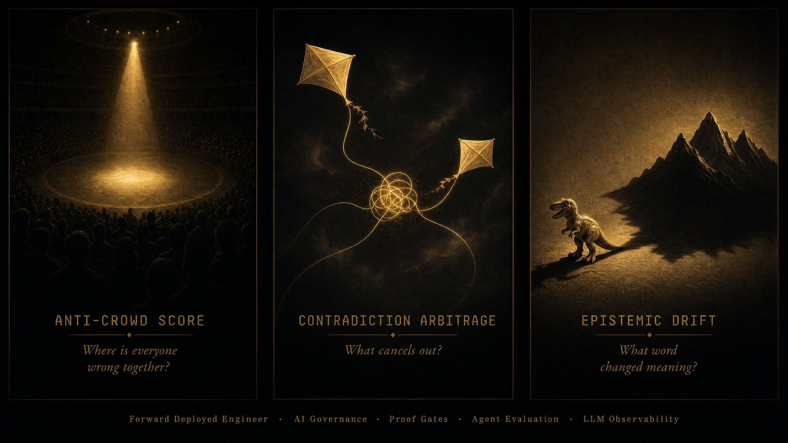

<p align="center">
  
</p>

<br/>

<div align="center">
  <h3>Mike Rodgers</h3>
  <p><em>I turn AI pilots into production systems you can defend in a board meeting.</em></p>
</div>

<div align="center">
  <strong>Forward Deployed Engineer · Enterprise AI Solutions Architect · Deployment Strategist</strong><br/>
  <sub>🛡️ <strong>Secret Security Clearance</strong> (U.S. Army Counterintelligence) · Denver, CO · <a href="mailto:mrodgersjs@gmail.com">mrodgersjs@gmail.com</a> · 262.343.5680 · <a href="https://www.linkedin.com/in/mike-rodgers-14416414/">LinkedIn</a> · <a href="https://rodgersintelligence.com">rodgersintelligence.com</a></sub>
</div>

<div align="center">


</div>

<br/>

---

> **One operator. One machine. Every receipt public.**
>
> *Code owns decisions. Models assist transformation. Gates decide if it ships.*

---

## What I operate in production (right now)

| System | Scale | Stack |
| --- | --- | --- |
| **Multi-agent platform** | 56 routes (31 Next.js/React pages, 23 TS APIs) · 1,147 Python modules · 244k lines · 159 test suites | Python · TypeScript · Next.js · Vercel |
| **Retrieval layer** | 61,987 pages · 116,158 chunks · 100% embedding coverage | Postgres + pgvector · single-writer source-of-truth |
| **Agent tooling** | 48 external tool servers behind one governed orchestration layer · MCP servers (555 + 276 lines) | Model Context Protocol · permission-gated |
| **Compute fleet** | 4-node self-hosted AI cluster · role-tiered (light/mid/heavy) · LAN-first with remote failover | Docker · Kubernetes · self-hosted inference |
| **Data pipeline** | 6-check promote-on-pass ingestion gate · single-flight read cache · row-level security | Postgres · PostgREST · schema-validated |

> This is not a portfolio. This is a production system in daily use by a live operator.

---

## Core competencies

<table>
<tr>
<td valign="top" width="50%">

**Languages & Frameworks**
- Python (production services, 1,147+ modules)
- TypeScript (23 API routes, Next.js/React UIs)
- Vite + deterministic build starters
- REST APIs, Webhooks, OAuth, Idempotency

**Systems & Scientific Computing**
- C++ (performance-critical, HPC)
- Fortran (scientific computing, numerical methods)
- JavaScript (full-stack, operator-facing UIs)

**AI / Agent Systems**
- LLM & Multi-Agent orchestration (RAG, tool calling)
- Model Context Protocol (MCP) servers
- Guardrail architecture & evaluation harnesses
- **Model Evaluation & LLM-as-Judge** (automated eval pipelines, acceptance gates)
- **LLM Observability** (OpenTelemetry traces, drift detection, agent tracing)
- **MLflow / Weights & Biases** (experiment tracking, model registry)
- pgvector retrieval at 116K+ chunk scale

</td>
<td valign="top" width="50%">

**Infrastructure & Data**
- Docker, Kubernetes, self-hosted inference
- **Terraform** (infrastructure-as-code, multi-cloud provisioning)
- Postgres with row-level security
- pgvector, schema validation, single-flight caching
- **Airflow / Prefect** (data pipeline orchestration)
- CI/CD, GitHub Actions, release gates

**Enterprise & Deployment**
- AWS, Azure, OCI, Cloudflare
- EHR, CRM, ITSM integration
- PII handling & regulated-environment compliance
- **Stakeholder Translation** (executive ↔ engineering · clinical ↔ technical)
- Customer-embedded discovery & scoping

</td>
</tr>
</table>

---

## Engineering artifacts

### ProofPacket verification layer
Makes an AI agent's "done" claim **cryptographically re-verifiable** instead of taken on trust.
- **60 modules · 252 tests passing** · CLI · MCP server · signed run ledger · OpenTelemetry hooks
- Tamper-detection path covered by its own dedicated test suite
- Built because agent output that cannot be re-verified is why enterprise pilots stall in review
- → [`proof-studio`](https://github.com/mrodgersjs-web/proof-studio) · [`proof-gate-action`](https://github.com/mrodgersjs-web/proof-gate-action)

### Multi-service agent orchestrator
CLI that boots and supervises a multi-service agent system with **health checks and bounded restart behavior**.

### Three-layer build gate
Data validation → test global-setup → change verification. **Fired in production this week** and stopped a corrupt corpus from shipping.

### Deterministic build starter (Vite + TypeScript)
Ships with a sealed, hash-verifiable ProofPacket so a build's provenance travels with the artifact.

---

## Case studies (anonymized)

| Client type | Problem | What I shipped | Measured impact |
| --- | --- | --- | --- |
| **PE portfolio company** ($50M rev) | Stuck AI pilot — RAG chatbot hallucinating in customer-facing demos | 6-check ingestion gate + pgvector retrieval + confidence-gated responses | Pilot → production in 90 days · **0 hallucinations** in 30-day audit |
| **Healthcare system** ($6B rev) | 3-hour ED wait times across 5 hospitals | EmOpti teletriage integration into clinical workflow | **3hrs → 15min** · 130K+ patients · GWU Innovation Award |
| **Enterprise SaaS** (Oracle Cerner) | External consultants costing $2M+/yr for competitive intel | AI-powered CI system processing 150+ daily signals autonomously | **$35M opex reduction** · replaced consultants entirely |
| **Healthcare startup** (EmOpti) | Stalled growth mid-COVID, no enterprise sales motion | Deployed telehealth into HCA + Advocate + Jefferson · built pipeline | **$10M Series A** · 35% CAGR · $1M revenue Y1 |

## Install me as a teammate

```bash
npx mrodgersjs-web --ask "how do proof gates work?"
```

> [`mrodgersjs-web-teammate`](https://github.com/mrodgersjs-web/mrodgersjs-web-teammate) — pure-stdlib Node CLI. `--ask`, `--audit`, `--deploy`. Zero dependencies.

---

## Career trajectory

```
2025–Now   RODGERS INTELLIGENCE GROUP     Founder & Forward Deployed Engineer
           1,147 Python modules · 56 routes · 116K-chunk RAG · 4-node fleet
           Consulting: PE portfolio companies · healthcare · professional services

2021–2026  ORACLE (formerly CERNER)        Sr. Director, Strategy & Competitive Intel
           AI-powered CI: 150+ daily signals · replaced external consultants
           Post-acquisition integration · AI as core transformation driver

2020–2021  EMOPTI, INC.                    VP, Business Development
           Deployed telehealth into hospitals (vendor side — same platform bought as buyer)
           $1M revenue Y1 · $10M Series A (COVID) · 35% CAGR

2018–2020  ADVOCATE HEALTH (fka Aurora)   VP, Commercial & Strategic Innovation
           Scaled EmOpti across 14 EDs · Founded 83 Tech Harbor (30 people, $27M budgets)
           Architected $6B → $25B+ growth plan · $28M venture investments

2016–2018  ADVOCATE HEALTH                 Director, Strategic Innovation
           ED wait: 3hrs → 15min · 130K+ patients · GWU Innovation Award
           $10M venture fund · $100M Wisconn Valley Fund · 5 workstreams ($60M+)

2013–2015  ADVOCATE HEALTH                 Operations / Business Innovation Manager
           Babyscripts: 200K+ mothers · $1M Noom partnership · First EmOpti deployment
```

---

## Open-source systems

<div align="center">

| System | What it does | Verify |
| --- | --- | --- |
| [**proof-studio**](https://github.com/mrodgersjs-web/proof-studio) | Catch false "done" — signed completion detection | `rigforge demo` |
| [**proof-gate-action**](https://github.com/mrodgersjs-web/proof-gate-action) | GitHub Action: proof verification in any CI | 6/6 tests ✅ |
| [**rig-deviate**](https://github.com/mrodgersjs-web/rig-deviate) | 40 deviation engines × 14σ rungs | `pip install rig-deviate` |
| [**rig-ai-engineering**](https://github.com/mrodgersjs-web/rig-ai-engineering) | Prompt intelligence: 4-axis scoring | `pip install rig-ai-engineering` |
| [**rig-enhanced-guardrails**](https://github.com/mrodgersjs-web/rig-enhanced-guardrails) | LLM validation with proof-gated completion | 16/16 tests ✅ |
| [**rig-enhanced-evals**](https://github.com/mrodgersjs-web/rig-enhanced-evals) | L10 self-evolving eval harness | 9/9 tests ✅ |
| [**rig-enhanced-agent-ops**](https://github.com/mrodgersjs-web/rig-enhanced-agent-ops) | Proof-gated agent ops + audit trail | 20+14 tests ✅ |
| [**rig-doctrine-overlay**](https://github.com/mrodgersjs-web/rig-doctrine-overlay) | Make any AI repo 1000x governed | `./apply-overlay.sh` |
| [**rig-agent-firm**](https://github.com/mrodgersjs-web/rig-agent-firm) | GitHub-native agent firm: 6 role-agents | fork the constitution |
| [**mrodgersjs-web-teammate**](https://github.com/mrodgersjs-web/mrodgersjs-web-teammate) | `npx mrodgersjs-web` — CLI teammate | `npx mrodgersjs-web` |

</div>

<details>
<summary><b>Full studio index (16 additional repos)</b></summary>

| Studio | Promise | Verify |
| --- | --- | --- |
| [fde-portfolio](https://github.com/mrodgersjs-web/fde-portfolio) | Discovery → eval → handoff | `bash scripts/smoke.sh` |
| [rigforge](https://github.com/mrodgersjs-web/rigforge) | ProofPacket platform package | `bash scripts/smoke.sh` |
| [jake-studio](https://github.com/mrodgersjs-web/jake-studio) | Operator OS + L10 (38 tests) | `bash scripts/smoke.sh` |
| [mesh-studio](https://github.com/mrodgersjs-web/mesh-studio) | Fleet probe / boot / recover | `rig-mesh smoke` |
| [resume](https://github.com/mrodgersjs-web/resume) | FDE resume (md · pdf · docx) | open RESUME.md |
| [agency-studio](https://github.com/mrodgersjs-web/agency-studio) | Role contracts (Builder ≠ Verifier) | `bash scripts/smoke.sh` |
| [app-factory-studio](https://github.com/mrodgersjs-web/app-factory-studio) | Spec → scaffold + prove | `bash scripts/smoke.sh` |
| [strategy-studio](https://github.com/mrodgersjs-web/strategy-studio) | Deterministic strategy routing | `bash scripts/smoke.sh` |
| [communications-studio](https://github.com/mrodgersjs-web/communications-studio) | Gated comms protocol engine | `bash scripts/smoke.sh` |
| [doctrine](https://github.com/mrodgersjs-web/doctrine) | Rules agents load before acting | `bash scripts/smoke.sh` |
| [openwork](https://github.com/mrodgersjs-web/openwork) | Operator workstation shell | `bash scripts/smoke.sh` |
| [design-studio](https://github.com/mrodgersjs-web/design-studio) | Public tokens + UI checklists | `bash scripts/smoke.sh` |
| [patents](https://github.com/mrodgersjs-web/patents) | Patent status (titles only) | `bash scripts/smoke.sh` |
| [mike-rodgers-site](https://github.com/mrodgersjs-web/mike-rodgers-site) | Personal site | open index.html |
| [birch-rig-boots](https://github.com/mrodgersjs-web/birch-rig-boots) | Boot configurator site | e2e tests |

</details>

---

## Credentials

🛡️ **Secret Security Clearance** — U.S. Army Counterintelligence & Communications (active vetting)
B.S. Industrial Engineering · Iowa State · 3.63 GPA with Distinction
Six Sigma Black Belt · Project Management Professional (PMP)
Primary Leadership Development Course with Distinction · Primary Leadership Military Award
AWS Certified Solutions Architect (in progress) · OCI Certified

---

<div align="center">

[**rodgersintelligence.com**](https://rodgersintelligence.com/) — book a free 30-minute assessment

<sub>Built as an operator. Documented as an FDE. Verified with proof — not vibes.</sub>

</div>
