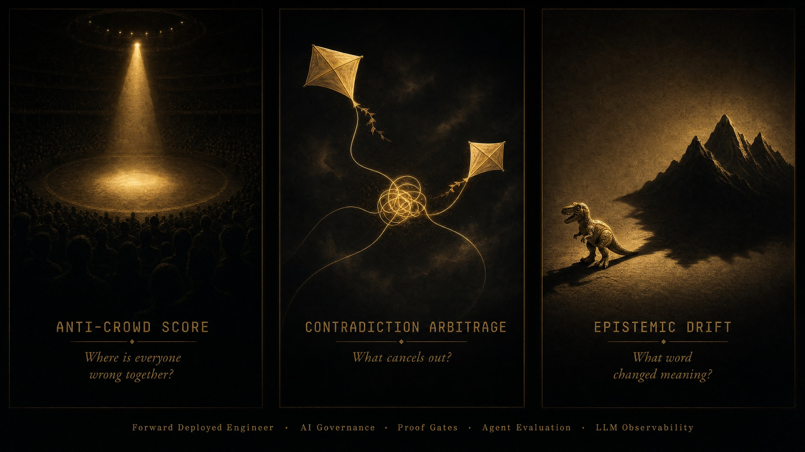

  

  <h1>Mike Rodgers</h1>
  
<strong>I turn AI pilots into production systems you can defend in a board meeting.</strong>

  Forward Deployed Engineer · Denver · <a href="mailto:mrodgersjs@gmail.com">mrodgersjs@gmail.com</a> · <a href="https://www.linkedin.com/in/mike-rodgers-14416414/">LinkedIn</a> · <a href="https://rodgersintelligence.com/">rodgersintelligence.com</a>

> **One operator. One machine. Every receipt public.**

## Pinned systems

| System | What it demonstrates | Verify |
| --- | --- | --- |
| [**rigforge**](https://github.com/mrodgersjs-web/rigforge) | Builds and checks ProofPacket evidence through a reproducible smoke path. | `git clone https://github.com/mrodgersjs-web/rigforge.git && (cd rigforge && python3 -m venv .venv && . .venv/bin/activate && bash scripts/smoke.sh)` |
| [**proof-studio**](https://github.com/mrodgersjs-web/proof-studio) | Verifies signed completion evidence and detects tampering. | `git clone https://github.com/mrodgersjs-web/proof-studio.git && (cd proof-studio && python3 -m venv .venv && . .venv/bin/activate && bash scripts/smoke.sh)` |
| [**mesh-studio**](https://github.com/mrodgersjs-web/mesh-studio) | Probes, boots, and recovers a local agent-service mesh. | `git clone https://github.com/mrodgersjs-web/mesh-studio.git && (cd mesh-studio && python3 -m venv .venv && . .venv/bin/activate && bash scripts/smoke.sh)` |
| [**communications-studio**](https://github.com/mrodgersjs-web/communications-studio) | Scores a draft message against formulas and hard gates, then emits or rejects it, with pytest as the claim under test. | `git clone https://github.com/mrodgersjs-web/communications-studio.git && (cd communications-studio && python3 -m venv .venv && . .venv/bin/activate && bash scripts/smoke.sh)` |
| [**deviatrix-genesis**](https://github.com/mrodgersjs-web/deviatrix-genesis) | Runs an idea through three diamonds, three expeditions and seven stages, with a verifier that signs each sealed proof packet. | `git clone https://github.com/mrodgersjs-web/deviatrix-genesis.git && (cd deviatrix-genesis && python3 -m venv .venv && . .venv/bin/activate && pip install sympy && PYTHONPATH=. python3 -m unittest deviatrix_genesis.tests.test_deviatrix deviatrix_genesis.v3.tests.test_v3 deviatrix_genesis.v4.tests.test_memory_export deviatrix_genesis.v5.tests.test_v5)` |
| [**jake-studio**](https://github.com/mrodgersjs-web/jake-studio) | Checks the L10 harness modules offline: certainty engine, cognition stack, nocturne and agent factory. | `git clone https://github.com/mrodgersjs-web/jake-studio.git && (cd jake-studio && python3 -m venv .venv && . .venv/bin/activate && bash scripts/smoke.sh)` |

## How a recruiter should spend 10 minutes

1. **0–2 minutes.** Open [`rigforge`](https://github.com/mrodgersjs-web/rigforge) and its [latest smoke receipt](https://github.com/mrodgersjs-web/rigforge/actions/workflows/smoke.yml).
2. **2–4 minutes.** Select the pinned system closest to the role.
3. **4–6 minutes.** Copy its Verify command and run the public smoke path.
4. **6–8 minutes.** Inspect the linked receipt's state, date, and commit SHA.
5. **8–10 minutes.** Compare the three competencies with the credentials, then use the contact line above.

## Recent receipts

Per-repo scores and the next fix for each repo: [steward/scoreboard/SCORECARD.md](steward/scoreboard/SCORECARD.md).

<!-- recent_receipts starts -->
Steward score. **66/100 green**. Measured `2026-10-11`.

| Pinned system | Latest release | Latest smoke run |
| --- | --- | --- |
| [rigforge](https://github.com/mrodgersjs-web/rigforge) | [v0.1.0](https://github.com/mrodgersjs-web/rigforge/releases/tag/v0.1.0) · `2026-10-11` | [success](https://github.com/mrodgersjs-web/rigforge/actions/runs/34283965430) · `2026-09-08` · `7ddca26` |
| [proof-studio](https://github.com/mrodgersjs-web/proof-studio) | [v0.1.0](https://github.com/mrodgersjs-web/proof-studio/releases/tag/v0.1.0) · `2026-10-11` | [success](https://github.com/mrodgersjs-web/proof-studio/actions/runs/38102541137) · `2026-10-11` · `bfe3b50` |
| [mesh-studio](https://github.com/mrodgersjs-web/mesh-studio) | [v0.1.0](https://github.com/mrodgersjs-web/mesh-studio/releases/tag/v0.1.0) · `2026-10-11` | [success](https://github.com/mrodgersjs-web/mesh-studio/actions/runs/38102533234) · `2026-10-11` · `2481cb5` |
| [communications-studio](https://github.com/mrodgersjs-web/communications-studio) | [v0.1.0](https://github.com/mrodgersjs-web/communications-studio/releases/tag/v0.1.0) · `2026-10-11` | [success](https://github.com/mrodgersjs-web/communications-studio/actions/runs/38095627254) · `2026-10-10` · `682de64` |
| [deviatrix-genesis](https://github.com/mrodgersjs-web/deviatrix-genesis) | [v0.1.0](https://github.com/mrodgersjs-web/deviatrix-genesis/releases/tag/v0.1.0) · `2026-10-11` | [success](https://github.com/mrodgersjs-web/deviatrix-genesis/actions/runs/38102545402) · `2026-10-11` · `bb714b1` |
| [jake-studio](https://github.com/mrodgersjs-web/jake-studio) | [v0.1.0](https://github.com/mrodgersjs-web/jake-studio/releases/tag/v0.1.0) · `2026-10-11` | [success](https://github.com/mrodgersjs-web/jake-studio/actions/runs/38102604124) · `2026-10-11` · `65f4c4b` |
<!-- recent_receipts ends -->

## Competencies

| Competency | Applied to |
| --- | --- |
| **Python** | Automation and backend systems |
| **TypeScript** | Typed application interfaces |
| **Postgres** | Relational data and retrieval |

## Credentials

- U.S. Army Counterintelligence veteran
- B.S. Industrial Engineering, Iowa State University
- Six Sigma Black Belt
- Project Management Professional (PMP)

[**rodgersintelligence.com**](https://rodgersintelligence.com/) · [mrodgersjs@gmail.com](mailto:mrodgersjs@gmail.com)

